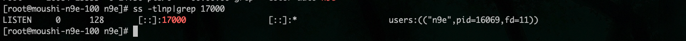

# 夜莺安装与配置

[夜莺官方部署文档](https://flashcat.cloud/docs/content/flashcat-monitor/nightingale-v6/install/intro/)

夜莺官方推荐二进制安装，具体安装步骤参考与官网

## 一、二进制安装夜莺

### 1.1 部署安装 mysql

安装 mysql

```shell
yum -y install mariadb*
systemctl enable mariadb
systemctl restart mariadb
```

设置登陆密码

```shell
mysql -e "SET PASSWORD FOR 'root'@'localhost' = PASSWORD('passw0rd');"
```

开启远程登录

登录 mysql 后，执行一下语句，开启远程登录

```sql
GRANT ALL PRIVILEGES ON *.* TO 'root'@'%' IDENTIFIED BY 'passw0rd' WITH GRANT OPTION;
```

### 1.2 部署安装 redis

这里采用二进制安装，请参考 [redis 二进制安装与配置](../../operations/redis/redis_binary_installed.md)

### 1.3 部署夜莺

**安装夜莺**

夜莺最新安装包[下载地址](https://flashcat.cloud/download/nightingale/),截止到目前，最近版本是`v6.1.0`

(1) 创建个 n9e 的目录，后面把 n9e 相关的文件解压到这里

```shell
mkdir -p /opt/n9e && cd /opt/n9e
```

(2) 下载 n9e 发布包，amd64 是 x84 的包，下载站点也提供 arm64 的包，如果需要其他平台的包则要自行编译了

```shell
tarball=n9e-v6.0.1-linux-amd64.tar.gz
urlpath=https://download.flashcat.cloud/${tarball}
wget -q $urlpath || exit 1
```

(3)解压安装包到`/opt/n9e`

```shell
tar -zxvf n9e-v6.0.1-linux-amd64.tar.gz -C /opt/n9e/
```

(4) 解压缩之后，可以看到 n9e.sql 是建表语句，导入数据库

```shell
mysql -uroot -ppassw0rd < n9e.sql
```

**注:** passw0rd 为第一步创建 mariab 时候的创建的密码

(5) 修改`n9e`数据库配置

配置文件在安装目录下 `etc/config.toml`

```shell
DSN="root:passw0rd@tcp(127.0.0.1:3306)/n9e_v6?charset=utf8mb4&parseTime=True&loc=Local&allowNativePasswords=true"
```

(6) 启动测试

启动 n9e

```shell
nohup ./n9e &> n9e.log &
```

检查 n9e.log 是否有异常日志，检查端口是否在监听，正常应该监听在 17000

```shell
ss -tlnp|grep 17000
```

启动成功如下图

