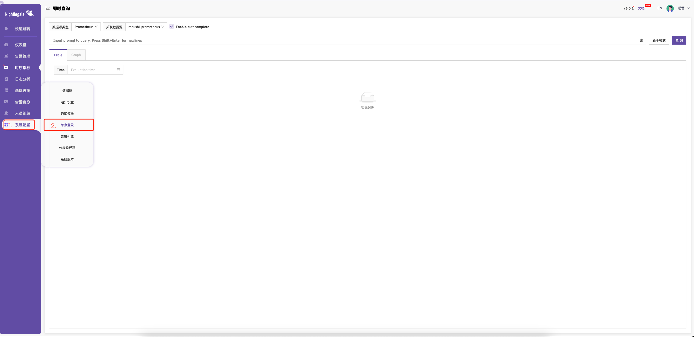

# 夜莺配置 ldap 单点登录

夜莺版本 v6.1.0

进入夜莺界面后，在系统配置中，找到单点登录，如下图



选择`ldap`后，进行相应的修改即可

参考配置如下

```conf
Enable = true # 开启
Host = 'ldap_host'
Port = 389
BaseDn = 'dc=n9e,dc=com,dc=cn' # ldap相关配置 仅供参考
BindUser = 'cn=Manager,dc=n9e,dc=com,dc=cn' # ldap 相关配置，仅供参考
BindPass = 'passw0rd'
# openldap format e.g. (&(uid=%s))
# AD format e.g. (&(sAMAccountName=%s))
AuthFilter = '(&(uid=%s))'
CoverAttributes = true
TLS = false
StartTLS = true
DefaultRoles = ['Standard']

[Attributes]
Nickname = 'cn'
Phone = 'mobile'
Email = 'mail'
```
