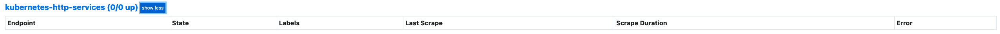
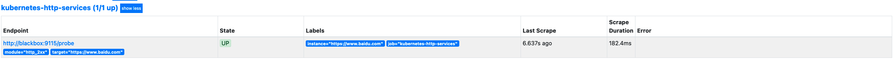

# prometheus 域名状态码监控

## 一、安装 blackbox

### 1.1 二进制安装

是 Prometheus 社区提供的官方黑盒监控解决方案，其允许用户通过：HTTP、 HTTPS、 DNS、 TCP 以及 ICMP 的方式对网络进行探测

👉🏻 blackbox [下载地址](https://github.com/prometheus/blackbox_exporter/releases)

执行以下命令，下载并安装`blackbox`

```shell
# 下载二进制文件
wget https://github.com/prometheus/blackbox_exporter/releases/download/v0.24.0/blackbox_exporter-0.24.0.linux-amd64.tar.gz

# 解压二进制文件
tar -zxvf blackbox_exporter-0.24.0.linux-amd64.tar.gz -C /opt/

# 重命名
mv blackbox_exporter-0.24.0.linux-amd64 blackbox_exporter
```

解压后的文件结构如下

```PlainText
├── blackbox_exporter # 二进制文件
├── blackbox.yml      # 配置文件
├── LICENSE
└── NOTICE
```

配置文件可使用如下配置

```yaml
modules:
  http_2xx: # http 检测模块  Blockbox-Exporter 中所有的探针均是以 Module 的信息进行配置
    prober: http
    timeout: 10s
    http:
      valid_http_versions: ['HTTP/1.1', 'HTTP/2']
      valid_status_codes: [200] # 这里最好作一个返回状态码，在grafana作图时，有明示---陈刚注释。
      method: GET
      preferred_ip_protocol: 'ip4'
  http_post_2xx: # http post 监测模块
    prober: http
    timeout: 10s
    http:
      valid_http_versions: ['HTTP/1.1', 'HTTP/2']
      method: POST
      preferred_ip_protocol: 'ip4'
  tcp_connect: # TCP 检测模块
    prober: tcp
    timeout: 10s
  dns: # DNS 检测模块
    prober: dns
    dns:
      transport_protocol: 'tcp' # 默认是 udp
      preferred_ip_protocol: 'ip4' # 默认是 ip6
      query_name: 'kubernetes.default.svc.cluster.local'
```

启动`blackbox_exporter`

```shell
./blackbox_exporter --config=blackbox.yml
```

### 1.2 k8s 安装

准备安装文件 `blackbox_app.yaml`

```yaml
apiVersion: v1
kind: ConfigMap
metadata:
  name: blackbox-config
  namespace: kube-prometheus
data:
  blackbox.yml: |-
    modules:
      http_2xx:  # http 检测模块  Blockbox-Exporter 中所有的探针均是以 Module 的信息进行配置
        prober: http
        timeout: 10s
        http:
          valid_http_versions: ["HTTP/1.1", "HTTP/2"]
          valid_status_codes: [200]
          method: GET
          preferred_ip_protocol: "ip4"
      http_post_2xx: # http post 监测模块
        prober: http
        timeout: 10s
        http:
          valid_http_versions: ["HTTP/1.1", "HTTP/2"]
          method: POST
          preferred_ip_protocol: "ip4"
      tcp_connect:  # TCP 检测模块
        prober: tcp
        timeout: 10s
      dns:  # DNS 检测模块
        prober: dns
        dns:
          transport_protocol: "tcp"  # 默认是 udp
          preferred_ip_protocol: "ip4"  # 默认是 ip6
          query_name: "kubernetes.default.svc.cluster.local"
---
apiVersion: apps/v1
kind: Deployment
metadata:
  name: blackbox
  namespace: kube-prometheus
spec:
  selector:
    matchLabels:
      app: blackbox
  template:
    metadata:
      labels:
        app: blackbox
    spec:
      containers:
        - image: prom/blackbox-exporter:v0.16.0
          name: blackbox
          args:
            - --config.file=/etc/blackbox_exporter/blackbox.yml # ConfigMap 中的配置文件
            - --log.level=error # 错误级别控制
          ports:
            - containerPort: 9115
          volumeMounts:
            - name: config
              mountPath: /etc/blackbox_exporter
      volumes:
        - name: config
          configMap:
            name: blackbox-config
---
apiVersion: v1
kind: Service
metadata:
  name: blackbox
  namespace: kube-prometheus
spec:
  selector:
    app: blackbox
  ports:
    - port: 9115
      targetPort: 9115
```

执行一下命令，进行安装

```shell
kubectl apply -f blackbox_app.yaml
```

输出如下

```PlainText
configmap/blackbox-config created
deployment.apps/blackbox created
service/blackbox created
```

## 二、配置 prometheus

在`prometheus`中配置`blackbox`抓取配置

```yaml
apiVersion: v1
kind: ConfigMap
metadata:
  name: prometheus-config
  namespace: kube-prometheus
data:
  prometheus.yml: |
    global:
      scrape_interval: 15s
      scrape_timeout: 15s
    scrape_configs:
    - job_name: 'prometheus'
      static_configs:
      - targets: ['localhost:9090']

    # 配置http模块,没有采用参考文档，因为检测的是外部域名
    - job_name: 'kubernetes-http-services'
      metrics_path: /probe
      params:
        module: [http_2xx]  # 使用定义的http模块
      relabel_configs:
      - source_labels: [__address__]
        target_label: __param_target
      - source_labels: [__param_target]
        target_label: instance
      - target_label: __address__
        replacement: blackbox:9115  # 这里的9115是Exporter的默认端口
```

首先获取 `targets` 实例的 `__address__`值写进`__param_target`，`__param_<name>`形式的标签里的 name 和它的值会被添加到发送到黑盒的 http 的 header 的 params 当作键值，例如`__param_module`对应 params 里的 module。
然后获取`__param_target`的值，并覆写到 `instance` 标签中，覆写 Target 实例的 `__address__` 标签值为 `BlockBoxExporter` 实例的访问地址，向 `blackbox:9115` 发送请求获取实例的 `metrics` 信息。

然后更新配置：

```shell
kubectl apply -f prometheus-cm.yaml
```

输出如下

```PlainText
configmap/prometheus-config configured
```

重新加载配置

```shell
# 这里配置了域名解析
curl -X POST http://prometheus.com/-/reload
```

打开`prometheus` 找到`target`，就可以看到上面定义的`kubernetes-http-services`任务了

service-http


目前还没添加域名，所以为空

要添加监控的域名，就在`kubernetes-http-services`添加`static_configs`

`kubernetes-http-services`配置如下

```yaml
- job_name: 'kubernetes-http-services'
  metrics_path: /probe
  params:
    module: [http_2xx] # 使用定义的http模块
  static_configs:
    - targets:
    - https://www.baidu.com
  relabel_configs:
    - source_labels: [__address__]
      target_label: __param_target
    - source_labels: [__param_target]
      target_label: instance
    - target_label: __address__
      replacement: blackbox:9115 # 这里的9115是Exporter的默认端口
```

保存后，执行上述更新配置命令和`reload`命令

然后重新打开`promehtues`的`target`,已经注册上去了



## 三、prom sql

配置`prometheus`监控告警，检查状态码非`200`

```sql
probe_http_status_code != 200
```

如果除了`200`还有其他状态码，如`301`、`424` 等，可以用如下`sql`

```sql
probe_http_status_code != 200 unless probe_http_status_code == 424
```

此`prom sql`表示，查找状态码非`200`或者非`424`的数据

另外一种查询方式是，查询 10 分钟之内，状态码有变化的数据

```sql
changes(probe_http_status_code[10m])
```

#### 参考文档

- [使用 Prometheus 进行黑盒(blackbox) 监控](https://cloud.tencent.com/developer/article/1782670)
