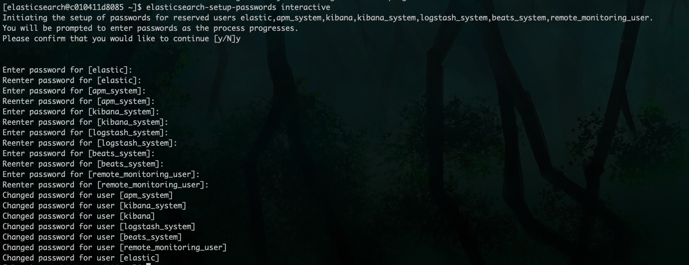

# elasticsearch docker 安装与配置(7.10.0 版本)

## 前期准备

依赖`docker`和 `docker-compose环境`

**注:** `docker` 环境搭建不建议用于生产环境，仅用于学习和开发环境使用

请参考

👉🏻 [docker 安装与配置](../docker/linux_docker_installed.md)

👉🏻 [docker-compose 安装](../docker/linux_docker_compose_installed.md)

## docker-compose 安装 mongodb

**1、创建专属的运维网络,用户跟其他容器交互**

**注:** 创建之前，可以执行以下命令查看`ops_network`网络是否存在，若存在就无需创建

```shell
docker network ls |grep ops_network
```

如果有如下输出就无需创建

```PlainText
514e3dd06943   ops_network   bridge    local
```

```shell
docker network create ops_network
```

**2、部署文件准备**

在`/data` 目录下，新建`elasticsearch`目录

```shell
mkdir /data/elasticsearch
```

**注:** `/data` 目录可选的，可以选择其他目录

在`/data/elasticsearch`下新建`docker-compose.yaml`, `run.sh` , `stop.sh`, `.env` 和 `es_data`文件夹

```shell
mkdir -p /data/elasticsearch/es_data

cat > /data/mongodb/docker-compose.yaml<< EOF
version: '3.1'

services:
  elasticsearch:
    image: "docker.elastic.co/elasticsearch/elasticsearch:${ES_VERSION}"
    container_name: elasticsearch
    environment:
      TZ: Asia/Shanghai
      LANG: en_US.UTF-8
      discovery.type: single-node
      ES_JAVA_OPTS: "-Xmx512m -Xms512m"
      ELASTIC_PASSWORD: "passw0rd" # elastic账号密码
    volumes:
      - /etc/localtime:/etc/localtime
      - ./es_data:/usr/share/elasticsearch/data
    ports:
      - "12200:9200"
      - "12300:9300"
    user: "1000:1000"
    networks:
      - ops_network

  kibana:
    depends_on:
      - elasticsearch
    image: "docker.elastic.co/kibana/kibana:${ES_VERSION}"
    container_name: kibana
    environment:
      - ELASTICSEARCH_URL=http://elasticsearch:9200
    volumes:
      - /etc/localtime:/etc/localtime
    ports:
      - "8601:5601"
    links:
      - elasticsearch
    networks:
      - ops_network

networks:
  ops_network:
    external: true
EOF
```

下面两个操作很重要，给`es`持久化文件赋予权限，不然启动会报权限问题

```shell
# 给es_data es_config kibana_config赋予权限，不然启动会报文件权限问题，这个很重要
sudo chown -R 1000:1000 /data/elasticsearch/es_data


# 设置es版本
cat > /data/elasticsearch/.env << EOF
ES_VERSION=7.1.0
EOF
```

启动脚本

```shell
cat > /data/elasticsearch/run.sh<< EOF
#!/bin/bash

docker-compose -p es-server up -d
EOF

chmod +x /data/elasticsearch/run.sh
```

停止脚本

```shell
cat > /data/elasticsearch/stop.sh<< EOF
#!/bin/bash

docker-compose -p es-server down
EOF

chmod +x /data/elasticsearch/stop.sh
```

目录结构如下

```PlainText
.
├── .env
├── docker-compose.yaml
├── es_data
├── run.sh
└── stop.sh
```

**3、启动与关闭**

启动

```shell
cd /data/elsaticsearch/
./run.sh
```

关闭

```shell
cd /data/elsaticsearch/
./stop.sh
```

**4、挂载出配置文件**

执行如下命令，将 elasticsearch 和 kibana config 文件拷贝出来

```shell
cd /data/elasticsearch
# 拷贝es config 文件
docker cp elasticsearch:/usr/share/elasticsearch/config es_config
# 拷贝 kibana config文件
docker cp kibana:/usr/share/kibana/config kibana_config
# 修改文件权限
chown -R 1000:1000 es_config kibana_config
```

关闭服务

```shell
cd /data/elsaticsearch/
./stop.sh
```

将`docker-compose.yaml`文件挂载配置修改
修改后的内容如下

```yaml
version: '3.1'

services:
  elasticsearch:
    image: 'docker.elastic.co/elasticsearch/elasticsearch:${ES_VERSION}'
    container_name: elasticsearch
    environment:
      TZ: Asia/Shanghai
      LANG: en_US.UTF-8
      discovery.type: single-node
      ES_JAVA_OPTS: '-Xmx512m -Xms512m'
      ELASTIC_PASSWORD: 'Passw0rd'
    volumes:
      - /etc/localtime:/etc/localtime
+     - ./es_config:/usr/share/elasticsearch/config
      - ./es_data:/usr/share/elasticsearch/data
    ports:
      - '12200:9200'
      - '12300:9300'
    user: '1000:1000'
    networks:
      - ops_network

  kibana:
    depends_on:
      - elasticsearch
    image: 'docker.elastic.co/kibana/kibana:${ES_VERSION}'
    container_name: kibana
    environment:
      - ELASTICSEARCH_URL=http://elasticsearch:9200
    volumes:
      - /etc/localtime:/etc/localtime
+     - ./kibana_config:/usr/share/kibana/config
    ports:
      - '8601:5601'
    links:
      - elasticsearch
    networks:
      - ops_network

networks:
  ops_network:
    external: true
```

启动

```shell
cd /data/elsaticsearch/
./run.sh
```

完整项目目录如下

```PlainText
├── .env
├── docker-compose.yaml
├── es_config
├── es_data
├── kibana_config
├── run.sh
├── stop.sh
└── zips
```

**5、配置密码**

**修改配置**

设置密码需要 启用 X-Pack 安全功能

需要修改`/data/elasticsearch/es_config/elasticsearch.yaml`文件 和 `/data/elasticsearch/kibana_config/kibana.yml`

`elasticsearch.yaml`修改内容如下，内容为新增内容

```yaml
# enable xpack
xpack.security.enabled: true
xpack.security.transport.ssl.enabled: true
```

```yaml
cluster.name: 'docker-cluster'
network.host: 0.0.0.0
# 开启es跨域
http.cors.enabled: true
http.cors.allow-origin: '*'
http.cors.allow-headers: Authorization
# 省略其他配置
# ...

# 在最后新增
# enable xpack
xpack.security.enabled: true
xpack.security.transport.ssl.enabled: true
```

`kibana.yml` 修改内容如下,内容为新增内容

```yaml
elasticsearch.username: 'elastic' # es账号
elasticsearch.password: '123456' # es密码
```

**重启服务**

参考步骤 3，启动与关闭

**重置密码**

进入`elasticsearch` 容器

```shell
docker exec -it elasticsearch bash
```

手动设置密码

```shell
elasticsearch-setup-passwords interactive
```

进入交互式操作,设置完密码即可,如下图




在容器里访问 es

```shell
curl 127.0.0.1:9200 -u elastic:123456
```

有正常返回即可

如下图

