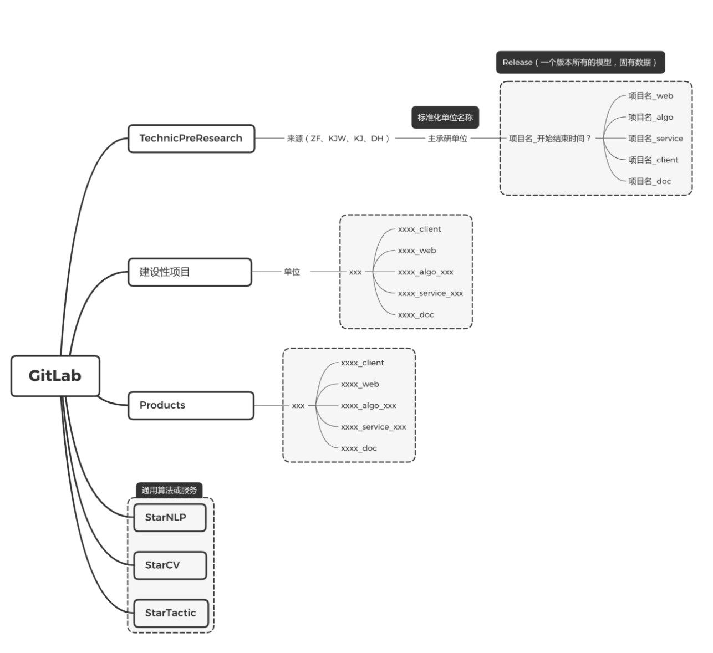

# git 开发管理规范

## 1、创建 Git 仓库

1、创建 README.md

2、创建.gitignore 文件，最基本包含如下内容

```plainText
.idea
log
.DS_Store
__pycache__
```

## 2、分支管理

**环境**

| 简称 | 备注           |
| ---- | -------------- |
| dev  | 开发和测试环境 |
| prod | 生产环境       |

**分支划分**
master 和 dev 不可直接提交，需要 pull request, code review 后 merge

| 分支    | 名称         | 环境 | 备注                                     |
| ------- | ------------ | ---- | ---------------------------------------- |
| master  | 主分支       | PROD | 用于正式版本部署，结合 git tag 使用      |
| dev     | 测试分支     | DEV  | 用于测试部署，实现持续集成，便于测试     |
| feature | 需求开发分支 | DEV  | 用于功能开发，由项目管理人员指定创建     |
| bugfix  | bug 修复分支 | DEV  | 用于修复 dev 分支测试出的 bug            |
| hotfix  | 紧急修复分支 | PROD | 用于修复 master 分支使用过程中发现的 bug |


1. 需求收集、论证和分解后，指定开发人员从 dev 分支根据需求创建 feature 分支；
2. 开发人员在 feature 分支开发，本地开发测试完成后提交到分支；
3. 先将 dev 与 feature 分支合并，并修复合并的 bug；
4. 在 bug 修复后将 feature 分支提交 pull request 到 dev 分支，由主开发人员审查后合并；
5. 测试人员在 dev 分支更新后，进行测试，并记录 bug；
6. 相关人员新建 bug 分支，修复 bug，提交 pull request，由主开发人员审查后合并；
7. 测试通过后由项目/技术负责人进行 code review，提交到 master 分支，使用 git tag 标记版本，并进行 release 发版，将相关模型和数据打包存储；
8. 线上使用过程中，发现 bug，创建 hotfix 分支，修复后，由项目/技术负责人合并到 master 分支，并同步到 dev 分支。

## 3、GitLab 的 group 管理

1. 分为几大基础 group：预研项目，建设性项目，产品，通用算法服务
2. 基础 group 下面根据来源单元、承研单位等建 subgroup，subgroup 下面建项目的 subgroup
3. 一个项目所有代码仓库都在一个 subgroup 里面
4. 一个项目的代码仓库共用一个主的名称，根据前后端来进行后缀命名
5. 一个项目必须有 doc 仓储，记录所有产品设计文档、设计图、技术设计文档、接口文档、测试文档，尽量使用 Markdown 格式。



## commit 日志规范

建议参考规范：

e.g

fix(首页模块)：修复弹窗 JS Bug。

type  表示动作类型，可分为:

fix：修复 xxx Bug

feat：新增 xxx 功能

test：调试 xxx 功能

style：变更 xxx 代码格式或注释

docs：变更 xxx 文档

refactor：重构 xxx 功能或方法

scope  表示影响范围，可分为：模块、类库、方法等。

subject  表示简短描述，最好不要超过 60 个字，如果有相关 Bug 的编号，建议在描述中加上。<br>
