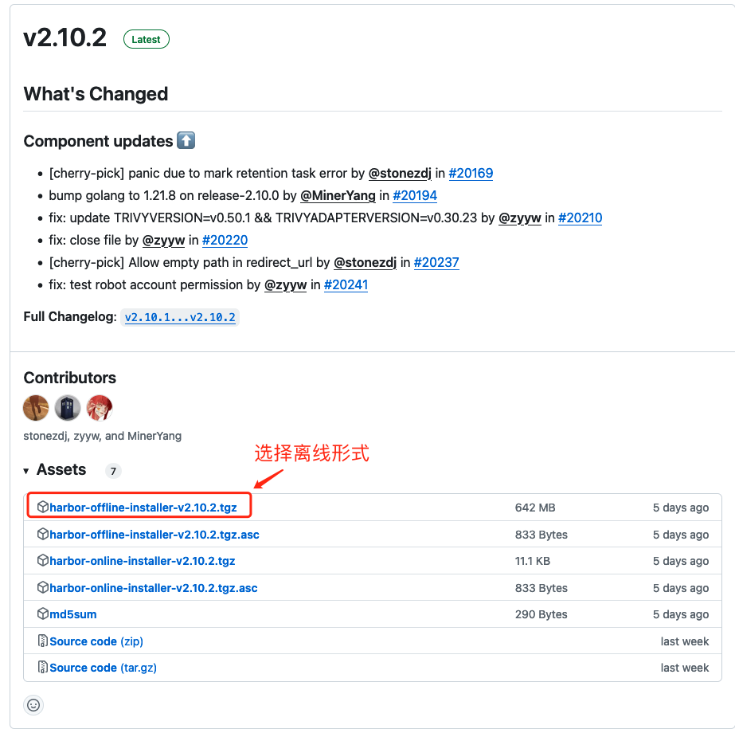
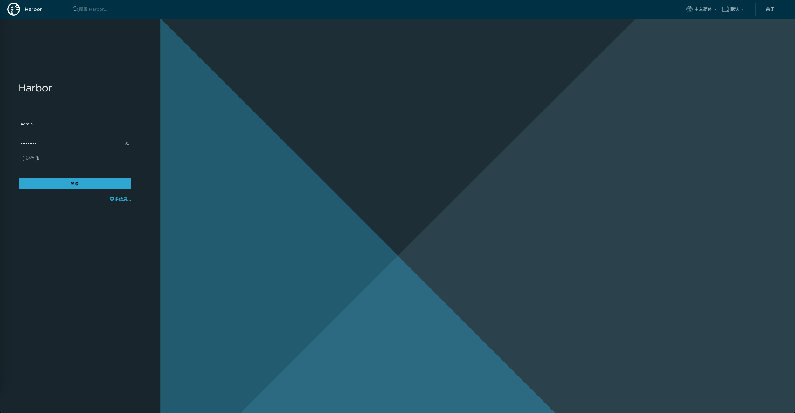

# harbor 安装与配置

## 前期准备

依赖`docker`和 `docker-compose环境`

请参考

👉🏻 [docker 安装与配置](../docker/linux_docker_installed.md)

👉🏻 [docker-compose 安装](../docker/linux_docker_compose_installed.md)

👉🏻 [harbor 官方文档](https://goharbor.io/)

## 安装 harbor

### 1、下载离线包

harbor 离线包[下载地址](https://github.com/goharbor/harbor/releases)


```shell
# Step 1: 下载选中的离线版本
wget https://github.com/goharbor/harbor/releases/download/v2.10.2/harbor-offline-installer-v2.10.2.tgz
```

### 2、准备证书文件

**注:** 如果不使用域名这一步可以跳过

证书购买请参考，阿里云官方文档 👉🏻 [SSL 证书快速上手](https://www.alibabacloud.com/help/zh/ssl-certificate/getting-started/get-started-with-ssl-certificates-service)

这里配置域名，下载后的 ssl 配置文件为 12808420_harbor.app.love_nginx.zip

### 3、安装

解压下载的文件

```shell
# Step 1: 解压harbor 离线安装包
tar -zxvf harbor-offline-installer-v2.10.2.tgz -C /usr/local/
# Step 2: 解压 ssl 证书
unzip 12808420_harbor.app.love_nginx.zip -d /usr/local/ssl/
```

### 4、配置

复制配置文件

```shell
# Step 1: 进入harbor 目录
cd /usr/local/harbor
# Step 2: 拷贝配置文件
cp harbor.yml.tmp harbor.yml
```

修改配置文件

```yaml
# Configuration file of Harbor

# The IP address or hostname to access admin UI and registry service.
# DO NOT use localhost or 127.0.0.1, because Harbor needs to be accessed by external clients.
-hostname: reg.mydomain.com
+hostname: harbor.app.love

# http related config
http:
  # port for http, default is 80. If https enabled, this port will redirect to https port
  port: 80

# https related config
https:
  # https port for harbor, default is 443
  port: 443
  # The path of cert and key files for nginx
- certificate: /your/certificate/path
+ certificate: /usr/local/harbor/ssl/harbor.app.love.pem
- private_key: /your/private/key/path
+ private_key: /usr/local/harbor/ssl/harbor.aoo.love.key

# # Uncomment following will enable tls communication between all harbor components
# internal_tls:
#   # set enabled to true means internal tls is enabled
#   enabled: true
#   # put your cert and key files on dir
#   dir: /etc/harbor/tls/internal

# Uncomment external_url if you want to enable external proxy
# And when it enabled the hostname will no longer used
# external_url: https://reg.mydomain.com:8433

# The initial password of Harbor admin
# It only works in first time to install harbor
# Remember Change the admin password from UI after launching Harbor.
- harbor_admin_password: Harbor12345
+ # 这里的是admin账户的密码，要在启动前改动，否则后期改动无效
+ harbor_admin_password: YourPassw0rd

# Harbor DB configuration

# The default data volume
data_volume: /data
...

```

### 5、启动 harbor

```shell
# Step 1: 创建数据目录
mkdir /data
# Step 2: 进入harbor目录
cd /usr/local/harbor
# Step 3: 执行prepare命令，进入准备启动阶段，这里会检测你的环境等
./prepare
# Step 4: 准备阶段完成后，启动下载harbor，这里会下载并运行7个镜像
./install.sh
```

使用 docker ps 查看是否启动(STATUS 均为 healthy 为成功，starting 说明在启动中)

```PlainText
CONTAINER ID   IMAGE                                 COMMAND                  CREATED      STATUS                PORTS                                                                            NAMES
f33fa914b17a   goharbor/harbor-jobservice:v2.10.1    "/harbor/entrypoint.…"   4 days ago   Up 4 days (healthy)                                                                                    harbor-jobservice
0056d04b6077   goharbor/nginx-photon:v2.10.1         "nginx -g 'daemon of…"   4 days ago   Up 4 days (healthy)   0.0.0.0:80->8080/tcp, :::80->8080/tcp, 0.0.0.0:443->8443/tcp, :::443->8443/tcp   nginx
94f9f5615503   goharbor/harbor-core:v2.10.1          "/harbor/entrypoint.…"   4 days ago   Up 4 days (healthy)                                                                                    harbor-core
b23a4327987d   goharbor/harbor-registryctl:v2.10.1   "/home/harbor/start.…"   4 days ago   Up 4 days (healthy)                                                                                    registryctl
d1337e58ec54   goharbor/redis-photon:v2.10.1         "redis-server /etc/r…"   4 days ago   Up 4 days (healthy)                                                                                    redis
4f4aeeae61dd   goharbor/harbor-db:v2.10.1            "/docker-entrypoint.…"   4 days ago   Up 4 days (healthy)                                                                                    harbor-db
d4ef619a56d0   goharbor/harbor-portal:v2.10.1        "nginx -g 'daemon of…"   4 days ago   Up 4 days (healthy)                                                                                    harbor-portal
d3ef7071fd2a   goharbor/registry-photon:v2.10.1      "/home/harbor/entryp…"   4 days ago   Up 4 days (healthy)                                                                                    registry
6e10fd5cd5f3   goharbor/harbor-log:v2.10.1           "/bin/sh -c /usr/loc…"   4 days ago   Up 4 days (healthy)   127.0.0.1:1514->10514/tcp                                                        harbor-log
```

### 5、访问 harbor

通过域名访问

<https://harbor.app.love>



终端操作

```shell
# Step 1: 在要使用harbor的主机上创建 /etc/docker/daemon.json 文件
sudo tee /etc/docker/daemon.json <<-'EOF'
{
    "registry-mirrors": [https://harbor.app.love"]
}
EOF
# Step 2: 重启daemon
systemctl daemon-reload
# Step 3: 重启docker
systemctl restart docker
# Step 4: 登陆harbor（注意：docker login harbor的地址）
docker login harbor.app.love -u admin -p YourPassw0rd
```

登录输出如下

```PlainText
WARNING! Using --password via the CLI is insecure. Use --password-stdin.
WARNING! Your password will be stored unencrypted in /root/.docker/config.json.
Configure a credential helper to remove this warning. See
https://docs.docker.com/engine/reference/commandline/login/#credentials-store

Login Succeeded
```

### 6、集成到 k8s

在对应命名空间，创建`secret`后引用即可

```shell
kubectl create secret docker-registry docker-key \
    --docker-server=harbor.app.love \
    --docker-username='admin' \
    --docker-password='YourPassw0rd' \
    --docker-email='email@email.com' \
    -n app-test
```

引用如下

```yaml
---
spec:
  containers: ...
  imagePullSecrets:
    - name: docker-key
```

#### 参考文档

- [Harbor 安装及配置](https://juejin.cn/post/7222656390548357177/)
