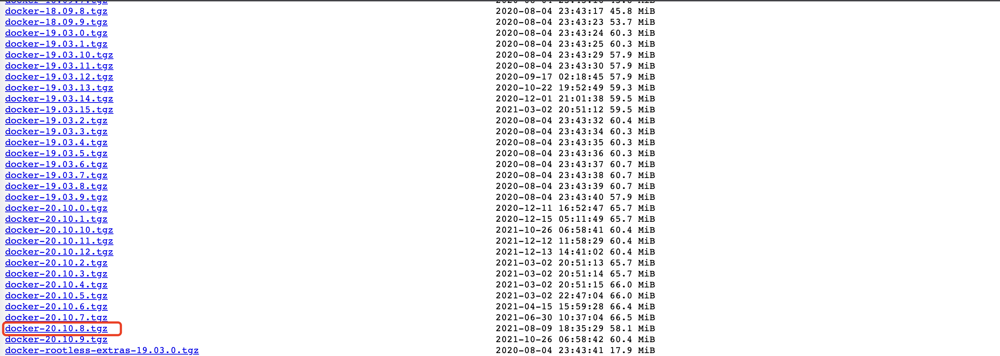

# linux docker 安装与配置

## 一、docker 离线安装

### 1.1、下载离线安装包

> 问地址: [docker 离线下载地址](https://download.docker.com/linux/static/stable/x86_64/)
>
> 选择对应版本,此处选择`docker-20-10.8.tgz`



可以下载到本地后上传至服务器，或者在服务器执行以下命令直接下载

```shell
yum -y install wget && wget https://download.docker.com/linux/static/stable/x86_64/docker-20.10.8.tgz
```

### 1.2、解压安装

执行以下命令，对第一步下载的`docker-20.10.8.tgz`进行解压

```shell
tar -zxvf docker-20.10.8.tgz
```

解压后会得到一个`docker`文件夹


执行以下命令，将 docker 命令添加到`/usr/bin/`目录下

```shell
cp docker/* /usr/bin/
```

验证

输入以下命令，验证是否生效

```shell
docker version
```


出现上述则说明安装成功，最下面的报错可以忽略，因为目前`docker`还没启动

### 1.3、启动 docker

需要配置 docker.service

docker.service 内容如下

```shell
cat > docker.service << EOF
[Unit]
Description=Docker Application Container Engine
Documentation=https://docs.docker.com
After=network-online.target firewalld.service containerd.service
Wants=network-online.target

[Service]
Type=notify
ExecStart=/usr/bin/dockerd
ExecReload=/bin/kill -s HUP $MAINPID
TimeoutSec=0
RestartSec=2
Restart=always
StartLimitBurst=3
StartLimitInterval=60s
LimitNOFILE=infinity
LimitNPROC=infinity
LimitCORE=infinity
TasksMax=infinity
Delegate=yes
KillMode=process

[Install]
WantedBy=multi-user.target
EOF
```

移动 docker.service 到如下目录

```shell
mv docker.service /usr/lib/systemd/system/
```

重新加载配置

```shell
systemctl daemon-reload
```

启动 docker

```shell
systemctl start docker
```

设置开机自启

```shell
systemctl enable docker
```

验证

输入以下命令，即可查看 docker 是否启动

```shell
systemctl status docker
```


启动成功，到此 docker 安装结束!

## 二、docker 在线安装

### 2.1、卸载已有 docker 服务

```shell
yum remove docker \
     docker-client \
     docker-client-latest \
     docker-common \
     docker-latest \
     docker-latest-logrotate \
     docker-logrotate \
     docker-engine
```

### 2.2、安装 epel 更新源

```shell
yum install -y epel-release
```

### 2.3、安装 docker 仓库

```
yum install -y yum-utils device-mapper-persistent-data lvm2
```

设置稳定仓库，将指定文件或 url 添加为 yum 源并启用

```shell
# 官方源
yum-config-manager --add-repo https://download.docker.com/linux/centos/docker-ce.repo

# 官方源速度较慢，可以修改为添加国内原
yum-config-manager --add-repo https://mirrors.aliyun.com/docker-ce/linux/centos/docker-ce.repo
```

**如果提示`yum-config-manager not found`，请执行以下命令安装**

```shell
yum install yum-utils
```

### 2.4、安装 docker

按版本号排序列出存储库中可用的版本号

```PlainText
(base) [root@moushi-ops-navigation-100 ~]# yum list docker-ce --showduplicates | sort -r
docker-ce.x86_64            3:24.0.6-1.el7                      docker-ce-stable
docker-ce.x86_64            3:24.0.5-1.el7                      docker-ce-stable
docker-ce.x86_64            3:24.0.4-1.el7                      docker-ce-stable
docker-ce.x86_64            3:24.0.3-1.el7                      docker-ce-stable
docker-ce.x86_64            3:24.0.2-1.el7                      docker-ce-stable
docker-ce.x86_64            3:24.0.1-1.el7                      docker-ce-stable
docker-ce.x86_64            3:24.0.0-1.el7                      docker-ce-stable
docker-ce.x86_64            3:23.0.6-1.el7                      docker-ce-stable
docker-ce.x86_64            3:23.0.5-1.el7                      docker-ce-stable
docker-ce.x86_64            3:23.0.4-1.el7                      docker-ce-stable
docker-ce.x86_64            3:23.0.3-1.el7                      docker-ce-stable
docker-ce.x86_64            3:23.0.2-1.el7                      docker-ce-stable
docker-ce.x86_64            3:23.0.1-1.el7                      docker-ce-stable
docker-ce.x86_64            3:23.0.0-1.el7                      docker-ce-stable
......
```

根据需要自行选择需要安装的版本

```shell
# 默认安装最新版本docker
yum install -y docker-ce docker-ce-cli containerd.io

# 此处安装指定版本docker
yum install -y docker-ce-23.0.0-1.el7 docker-ce-cli-23.0.0-1.el7 containerd.io

# 安装docker命令补全工具
yum install -y bash-completion
```

### 2.5、启动 docker

启动 docker

```shell
systemctl start docker
```

设置开机自启

```shell
systemctl enable docker
```

## 三、docker 配置

### 3.1 配置 docker 镜像下载加速器

```shell
tee /etc/docker/daemon.json << eof
{
    "registry-mirrors": [
        "https://1nj0zren.mirror.aliyuncs.com",
        "https://docker.mirrors.ustc.edu.cn",
        "http://f1361db2.m.daocloud.io",
        "https://registry.docker-cn.com"
    ]
}
eof
```

### 3.2 修改 docker 的默认镜像、容器数据存储位置

docker 的默认存储位置是 /var/lib/docker/ ，在根目录下，docker 运行一段时间后，会导致根目录存储爆炸。所有最好将存储位置自定义到服务器存储最大的目录下。

然后在 `/etc/docker/daemon.json` 文件中指定默认存储路径（此路径可自定义），添加以下内容：

```PlainText
"data-root": "/vdb/docker_images"
```

修改如下

```json
{
  "registry-mirrors": [
    "https://1nj0zren.mirror.aliyuncs.com",
    "https://docker.mirrors.ustc.edu.cn",
    "http://f1361db2.m.daocloud.io",
    "https://registry.docker-cn.com"
  ],
  "data-root": "/vdb/docker_images"
}
```

### 3.3 重新加载配置与重启 docker

重新加载配置

```shell
systemctl daemon-reload
```

重新启动 docker

```shell
systemctl restart docker
```

#### 参考文档

[1.Docker 系列之一：在线安装 docker 和下载镜像](https://blog.csdn.net/Sara_cloud/article/details/111193087)
