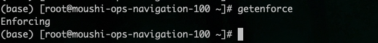
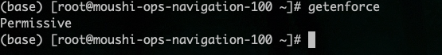
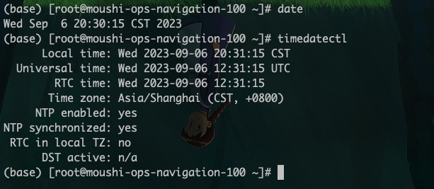

# linux 基础配置

## 一、务器系统配置初始化脚本

当拿到一台 linux 服务器，需要对 linux 做一些操作，来保证后续部署的服务能够高效稳定的运行。

### 1.1 关闭 swap 分区

**临时关闭**

```shell
swapoff -a
```

**永久关闭**

打开文件`/etc/fstab`

```shell
vim /etc/fstab
```

找到`swap`分区将其注释掉即可

```PlainText
#/dev/mapper/cl-swap     swap                    swap    defaults        0 0
```

**重启机器**

```shell
reboot
```

### 1.2 关闭 selinux

**查看 selinux 状态**

```shell
getenforce
```



**临时关闭**

```shell
setenforce 0
```

重启系统后还会开启

**永久关闭**

```shell
sed -i 's/SELINUX=enforcing/SELINUX=disabled/g' /etc/selinux/config
sed -i 's/SELINUX=enforcing/SELINUX=disabled/g' /etc/sysconfig/selinux
```

**重启机器**

```shell
reboot
```

**关闭后查看 selinux 状态**

```shell
getenforce
```



### 1.3 关闭防火墙

关闭防火墙命令如下

```shell
systemctl stop firewalld && systemctl disable firewalld
```

### 1.4 主机名配置

拿到主机后，需要给服务器配置一个主机名，就像每个人有自己的名字一样

配置主机名命令如下

```shell
hostnamectl --static set-hostname sirius
```

### 1.5 ssh 配置

**关闭 DNS 反查**
使用了 dns 反查，这种情况下当 ssh 登录某个 IP 时，系统会试图通过 DNS 反查相对应的域名，如果 DNS 中没有这个 IP 的域名解析，则会等到 DNS 查询超时才会进行下一步，消耗很长时间。

关闭 dns 反查命令如下

```shell
sed -ie "/UseDNS/s/yes/no/g;/UseDNS/s/#//g" /etc/ssh/sshd_config
```

**修改 ssh 超时时间**

```shell
vim /etc/ssh/sshd_config
```

修改下面两项

```PlainText
ClientAliveInterval 60
ClientAliveCountMax 30
```

**重启 ssh 服务**

```shell
systemctl restart sshd
```

### 1.6 修改系统时区

查看系统时区是否正常



上述图片是已经修改正常状态

修改系统时间命令如下

```shell
mv /etc/localtime /etc/localtime.bak
-s /usr/share/zoneinfo/Asia/Shanghai /etc/localtime
```

然后输入上图命令即可验证时间即可

#### 参考文档

- [Linux 使用 ssh 超时断开连接的真正原因](http://bluebiu.com/blog/linux-ssh-session-alive.html)
