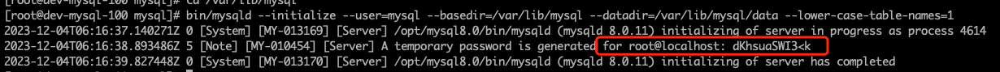

# mysql 二进制安装与配置

> mysql 各版本[下载地址](https://downloads.mysql.com/archives/community/)

## 前期准备

1、依赖`c`环境

如果没有安装`c`环境，执行以下命令，部署安装`c`环境

```shell
yum -y install gcc-c++
```

2、安装 `libaio`库

如果未安装，在初始化时可能遇到下面的报错：

```PlainText
bin/mysqld: error while loading shared libraries: libaio.so.1: cannot open shared object file: No such file or directory
```

```shell
yum -y install libaio
```

3、删除系统默认自带的`mariadb``

查询有没有安装 `mariadb``

```shell
rpm -aq | grep mariadb
```

输出如下

```PlainText
mariadb-libs-5.5.68-1.el7.x86_64
```

如果输出为空,忽略这一步

删除 `mariadb`

```shell
rpm -e --nodeps mariadb-libs-5.5.68-1.el7.x86_64
```

4、新建`mysql`用户

```shell
# 创建mysql 组
groupadd mysql
# 创建mysql用户
useradd -r -g mysql -s /bin/false mysql
```

## 二进制安装

下载二进制文件 👉🏻[mysql-8.0.11-linux-glibc2.12-x86_64.tar.gz](https://cdn.mysql.com/archives/mysql-8.0/mysql-8.0.11-linux-glibc2.12-x86_64.tar.gz)

```shell
wget https://cdn.mysql.com/archives/mysql-8.0/mysql-8.0.11-linux-glibc2.12-x86_64.tar.gz
```

**注:** 如果上述方式下载失败，请手动下载后传至服务器

**解压**

```shell
# 解压
tar -zxvf mysql-8.0.11-linux-glibc2.12-x86_64.tar.gz -C /opt/
# 重命名
mv /opt/mysql-8.0.11-linux-glibc2.12-x86_64 /opt/mysql8.0
```

在`myql8.0`目录下新建数据目录和加载目录

```shell
cd /opt/mysql8.0
mkdir data            # 数据目录
mkdir mysql-files     # 数据加载目录，由参数secure_file_priv指定
chmod 750 mysql-files # 修改加载目录权限
mkdir tmp             # 临时目录
chmod 750 tmp         # 修改权限
```

将`/opt/mysql8.0`属主修改为`mysql`用户

```shell
cd /opt
chown -R mysql:mysql mysql8.0
```

在`/var/lib`目录下新建软链接至`/opt/mysql8.0`（后续如果安装了多个版本的 `mysql`，只需要将软链接删除，重新链接至对应版本目录即可）

```shell
cd /var/lib
ln -s /opt/mysql8.0 mysql
```

创建`mysqld`文件，用于存储`pid`文件

```shell
mkdir /var/run/mysqld
chown -R mysql:mysql /var/run/mysqld
```

**注:** 上述文件路径，都在下面配置文件中体现，如有修改，需修改配置文件

**准备配置文件**

准备配置文件`my.cnf`，并放到`/etc`目录下（`/etc/my.cnf`）

```shell
touch /etc/my.cnf
```

如果存在不需要执行上述命令

下面准备了一份示例 my.cnf 文件，可以根据需要自行修改，几点说明如下：

- default_authentication_plugin，默认的密码认证方式特地设置和旧版本一致，防止某些旧的工具连不上 mysql.
- innodb_buffer_pool_size 设置为 2G（2 个池），自行根据机器情况调整，如果是专属数据库服务器，建议设置为物理内存的 60%~75%

```cnf
# MySQL configuration file for MySQL 8.0
# For explanations see
# http://dev.mysql.com/doc/mysql/en/server-system-variables.html

[mysqld]
# Server settings
user = mysql
# set server port
port = 3306
# sock file
socket = /var/lib/mysql/mysql.sock
# pid file
pid-file = /var/run/mysqld/mysqld.pid
# log file
log-error = /var/log/mysqld.log
# tmp dir
tmpdir = /var/lib/mysql/tmp
# tmp table size
tmp_table_size = 64M
# install dir
basedir = /var/lib/mysql
# data dir
datadir = /var/lib/mysql/data
# bind address
bind_address = 0.0.0.0
# max connections
max_connections = 3600
# max connect errors
max_connect_errors = 200
# auto commit
autocommit = ON
# table data not save to disk
symbolic-links = 0
# log time format
log_timestamps = system
# transaction isolation
transaction_isolation = read-committed
# When MySQL is restarted or restored, only the first and last binlog files are scanned
binlog_gtid_simple_recovery = ON
# default server character set
character-set-server = utf8mb4
# default server collation set
collation-server = utf8mb4_general_ci
# table swift cache
table_open_cache = 4096
# open files limit
open_files_limit = 65535
# connect timeout
connect_timeout = 9
# default storage engine is innodb
default-storage-engine = InnoDB
# slow log enable
slow_query_log = ON

# Binary log settings
# set server id
server-id = 1
# binlog enable
log-bin = mysql-bin
# binlog format
binlog_format = row
# binglog file size
max_binlog_size = 100M

# Innodb Settings
# innodb tmp dir
innodb_tmpdir = /var/lib/mysql/tmp/innodb
# innodb cache pool size (This value is 80% of the total memory)
innodb_buffer_pool_size = 2G

# Slow query log settings
# slow query enable
slow_query_log = ON
# slow query log file
slow_query_log_file = /var/log/mysql-slow.log
# slow query time
long_query_time = 1
# slow query admin log enable
log_slow_admin_statements = ON
# slow query slave log enable
log_slow_slave_statements = ON
# slow query not using index
log_queries_not_using_indexes = OFF

# lower case
lower_case_table_names = 1

# mysql config
[mysql]
socket=/usr/local/mysql/mysql.sock

# client set
[client]
port = 3306
# server sock file
socket = /var/lib/mysql/mysql.sock
```

**初始化数据库实例（注意记录初始 root 密码**

```shell
cd /var/lib/mysql
bin/mysqld --initialize --user=mysql --basedir=/var/lib/mysql --datadir=/var/lib/mysql/data --lower-case-table-names=1
```

初始化完成功，输出如下


上述图片中可以看到，初始化密码: dKhsuaSWI3<k

**注** 如果这里初始化时遇到 `could not open /var/log/mysqld.log` 等报错，可以手动创建此文件并将属主改为 `mysql`

```shell
touch /var/log/mysqld.log
chown -R mysql:mysql /var/log/mysqld.log
touch /var/log/mysql-slow.log
chown -R mysql:mysql /var/log/mysql-slow.log
```

**配置 PATH 环境变量**

这里以`root`用户演示

```shell
vim ~/.bashrc

# 配置mysql 环境变量
export MYSQL_HOME="/var/lib/mysql"
export PATH="${PATH}:${MYSQL_HOME}/bin"

# 保存后，刷新下环境变量
source ~/.bashrc
```

**启动 并登录 mysql**

使用初始密码登录（如果没记住去`/var/log/mysqld.log`中找），并修改 root 密码

```shell
# 启动mysql
nohup mysqld_safe &
# 使用初始密码登录
mysql -uroot -p'dKhsuaSWI3<k'
```

```sql
# 登录后修改root密码
ALTER USER 'root'@localhost identified BY 'passw0rd';
```

创建新用户，用于远程登录操作

```sql
CREATE USER 'dev'@'%' IDENTIFIED BY 'passw0rd';
GRANT ALL PRIVILEGES ON *.* TO 'dev'@'%' WITH GRANT OPTION;
FLUSH PRIVILEGES;
```
