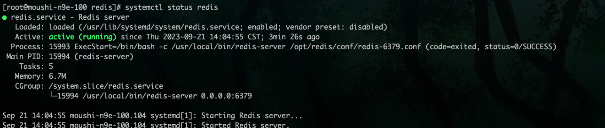

# redis 二进制安装与配置

> redis 各版本[下载地址](http://download.redis.io/releases/)

## 前期准备

依赖`c`环境

如果没有安装`c`环境，执行以下命令，部署安装`c`环境

```shell
yum -y install gcc-c++
```

## 二进制安装

这里采用了源码编译安装，版本是 7.0.8

```shell
# 下载源码包
yum -y install wget && wget http://download.redis.io/releases/redis-7.0.8.tar.gz

# 解压
tar -zxvf redis-7.0.8.tar.gz -C /usr/local

# 编译安装
cd /usr/local/redis-7.0.8
make && make install
```

## 配置 redis

redis 的默认配置文件就是位于 redis 安装目录下的 redis.conf

即`/usr/local/redis-7.0.8` 目录下

去掉 redis 注释信息，重新生成新的 redis_6379.conf

```shell
cat redis.conf | grep -v "#" | grep -v "^$" > redis-6379.conf
```

需要将`redis-6379.conf`配置中`dir`的值做如下修改

```PlainText
dir /opt/redis/db
```

打开守护进程

```PlainText
daemonize yes
```

修改 redis 日志路径

```PlainText
logfile /var/log/redis/redis.log
```

以守护进程方式启动，使用本启动方式，redis 将以服务的形式存在，日志将不再打印到命令窗口中

在'/opt'目录下新建`redis`目录，用于存放`conf` 配置文件, `db`数据存储等

```shell
mkdir -p /opt/redis/conf /opt/redis/db
mv /usr/local/redis-7.0.8/redis-6379.conf /opt/redis/conf
```

在`/var/log/`目录下创建 redis 文件夹，用于记录 redis 的日志输出

```shell
mkdir /var/log/redis
```

## 启动 redis

准备`redis.service`文件

```shell
cat > redis.service << EOF
[Unit]
Description=Redis server
After=syslog.target network.target remote-fs.target nss-lookup.target

[Service]
Type=forking
ExecStart=/bin/bash -c '/usr/local/bin/redis-server /opt/redis/conf/redis-6379.conf'
ExecStop=/bin/bash -c '/usr/local/bin/redis-cli shutdown'
Restart=always
PrivateTmp=true

[Install]
WantedBy=multi-user.target
EOF
```

配置 redis system 启动

将生成的 redis.service 文件移动到 `/usr/lib/systemd/system/`目录下

```shell
mv redis.service /usr/lib/systemd/system/
```

启动 redis

```shell
systemctl daemon-reload
systemctl enable redis
systemctl start redis
```

查看 redis 启动状态

```shell
systemctl status redis
```

如下图所示，则启动成功


